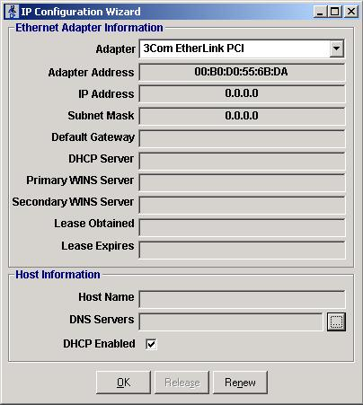



## IP Configuration Wizard

### Description

IP Wizard is a GUI interface for Windows 2000 to review your current TCP/IP network protocol settings. This can be useful when you are troubleshooting problems, such as problems connecting to your Internet provider. This application uses Windows Management Instrumentation (WMI).
 
### More Info
 

             |
---                |---
**Submitted On**   |2001-01-23 13:27:26
**By**             |[Michael Kempf](https://github.com/Planet-Source-Code/PSCIndex/blob/master/ByAuthor/michael-kempf.md)
**Level**          |Advanced
**User Rating**    |3.7 (11 globes from 3 users)
**Compatibility**  |VB 6\.0
**Category**       |[Complete Applications](https://github.com/Planet-Source-Code/PSCIndex/blob/master/ByCategory/complete-applications__1-27.md)
**World**          |[Visual Basic](https://github.com/Planet-Source-Code/PSCIndex/blob/master/ByWorld/visual-basic.md)
**Archive File**   |[CODE\_UPLOAD141131242001\.zip](https://github.com/Planet-Source-Code/michael-kempf-ip-configuration-wizard__1-14584/archive/master.zip)

